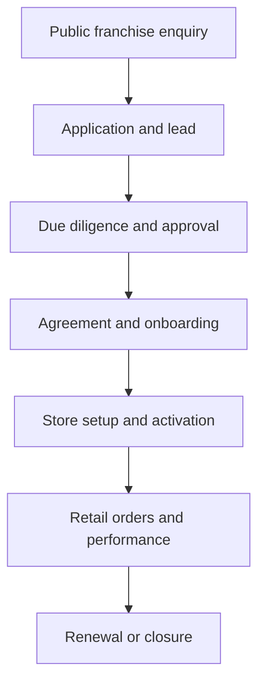

# Project 1 franchise lifecycle

**Baseline:** c54e933e36c68f2951e5e05afb32119ea02ea467
**Boundary:** Franchise Management and Franchise Retail Stores live in one cPanel. There is no separate Franchise Portal.
**Current implementation pass:** Batch 13 is in progress on the remote-aligned codex/batch-13 branch. It adds the dedicated live Franchise Dashboard and Store Setup workflow; final policy, visual, browser, accessibility and CI gates remain open.

## Target lifecycle

Every transition must be authorized, audited, communicated through Communication Center, tenant-scoped, recoverable, and visible in the appropriate reports.

## Current evidence

- POST /enquiry with type=franchise transactionally creates Inquiry, FranchiseApplication, Conversation and inbound Message.
- FranchiseApplication currently captures applicant name, email, phone, territory, preferred location, investment range, status and assigned admin.
- FranchiseManagementController owns franchise-dashboard, franchise-applications, franchise-territories, franchise-agreements, franchisees, franchise-retail-stores, store-setup, training-documents, marketing-assets, performance-targets, renewals, franchise-reports and data-management sections.
- FranchiseTerritoryController has a dedicated territory dashboard and CRUD/export routes.
- FranchiseStore is the current retail-store domain model; order routes include franchise and franchise_retail categories.
- AuditTrail is used on several franchise mutations.
- Batch 13 adds /admin/resource/franchise-dashboard as a live query-backed dashboard with drill-down KPI/pipeline links, Store Setup readiness rows, active-store links and recent-application links.
- Batch 13 adds /admin/resource/store-setup with UUID-keyed FranchiseMilestone records, a six-item readiness checklist, owner/due/evidence fields, state-aware start/block/complete/activate/reopen actions, soft-delete trash/restore, and audited mutations. Activation creates or updates the linked active FranchiseStore only after checklist completion and a unique store code.

## Required lifecycle records

| Stage | Primary records | Required private views/actions | Current gap |
|---|---|---|---|
| Lead | Inquiry, Conversation, Message | Inbox assignment, response, follow-up | No durable cross-record correlation ID |
| Application | FranchiseApplication | Application review, validation, status transition | Some sections use generic/fallback records |
| Due diligence | Application data, AuditLog, approvals | Checklist, owner/manager decision, rejection reason | Dedicated evidence/approval contract not proven |
| Agreement | Agreement record, revisions, AuditLog | Draft, approve, sign, renew, terminate | Domain workflow not fully evidenced |
| Onboarding | Milestones, training/documents, marketing assets | Assign, complete, block, notify | No complete milestone contract/test |
| Store setup | FranchiseStore, territory, price/product assignments, FranchiseMilestone(type=store_setup) | Setup checklist, start/block/complete/activate/reopen, evidence, trash/restore | Batch 13 foundation is implemented; operator scope, dependencies, suspension/closure policy, policy matrix and guide/browser evidence remain open |
| Retail operation | Franchise Retail Order, OrderItem, performance/targets | Store-scoped order/report actions | Store policies and price assignment incomplete |
| Renewal | Renewal record, performance and agreement state | Reminder, approve, renew, close | Renewal transition and scheduler proof incomplete |

## Personas and permissions

- Owner/admin: global Project 1 configuration and approved operational actions.
- Manager: assigned franchise/order/report actions within permitted scope.
- Editor: content/media changes only where granted.
- Support/Communication Center: customer/franchise communication, assignment and follow-up.
- Franchise/store operator: own assigned store/application/order views only.
- Reporting: read/report/export permissions only.
- No role may access Production, Finance, Payroll, HR, POS, or a separate portal through this project.

The current boolean admin gate is not equivalent to this least-privilege matrix. Policies and forbidden-action browser tests remain a required later batch.

## Franchise exit gate

A seeded application must be able to pass through approval, agreement, onboarding, store activation, retail order, performance and renewal with explicit state transitions, durable IDs/correlation, authorization, audit, Communication Center history, reports and rollback/recovery evidence.
